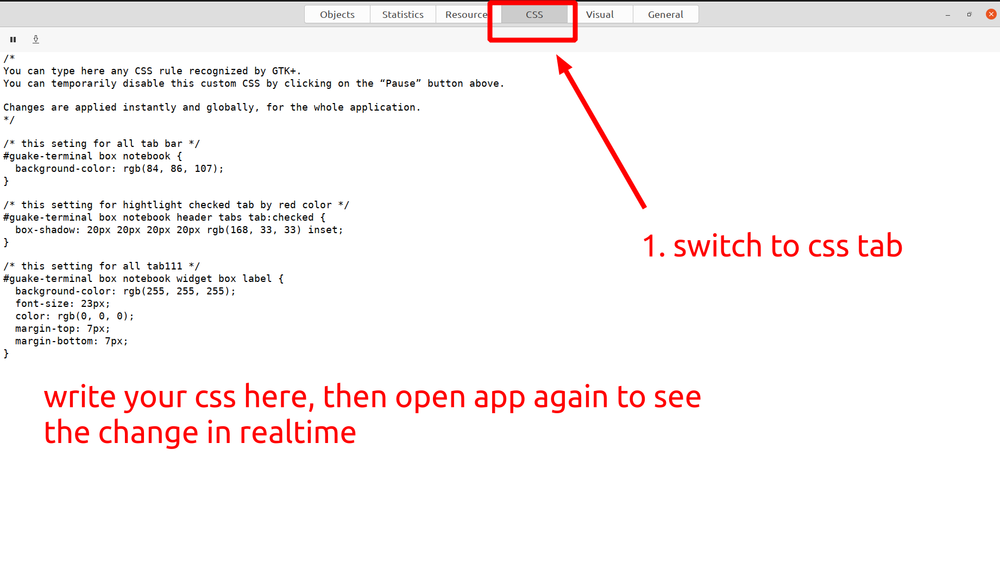

- [1. run on local](#1-run-on-local)
  - [1.1. prepare environment](#11-prepare-environment)
  - [1.2. debug](#12-debug)
- [2. mapping path then open vscode feature](#2-mapping-path-then-open-vscode-feature)
  - [2.1. Testing](#21-testing)
- [3. change stk css style](#3-change-stk-css-style)
  - [3.1. css file localtion](#31-css-file-localtion)
  - [3.2. using GTK Inspector for debug css](#32-using-gtk-inspector-for-debug-css)
  - [3.3. references](#33-references)

# 1. run on local

## 1.1. prepare environment

```shell
pyenv local 3.9.0
venv-create

make local-prepare-environment
make local-run
```

## 1.2. debug

1. run guake with debugpy

```shell
make dev-debug
```

2. run debug mode vscode
3. set breakpoints
4. reduce guake windows size, because when debug, guake terminal will stay in screen
5. do something in guake terminale

# 2. mapping path then open vscode feature

## 2.1. Testing

cd to guake repo

```shell
cd /home/xuananh/repo/guake/
```

copy bellow log and paste to terminal

```shell
Traceback (most recent call last):
  File "/app/main.py", line 190, in on_task_received
    strategy = strategies[type_]
```

Ctrl + click to "app/main.py", it will open [guake/main.py](guake/main.py) on vscode based on setting in file [.guake_mapping_path.json](.guake_mapping_path.json)

# 3. change stk css style

## 3.1. css file localtion

~/.config/gtk-3.0/gtk.css

## 3.2. using GTK Inspector for debug css

Run guake by command:

```shell
GTK_DEBUG=interactive m local-run
```

it will run guake and GTK Inspector :


do as above image to inspect element in guake, it will show as below


choose another function: CSS nodes as bellow


you can see above image to know how to get right css selector and set attribute for it

in above image, we got css selector for selected tab in guake terminal, then set its box-shadow color to highlight selected tab

you can test your css by switch to css tab



## 3.3. references

https://blog.gtk.org/2017/04/05/the-gtk-inspector/

https://gtkthemingguide.vercel.app/#/creating_gtk_themes?id=selectors

