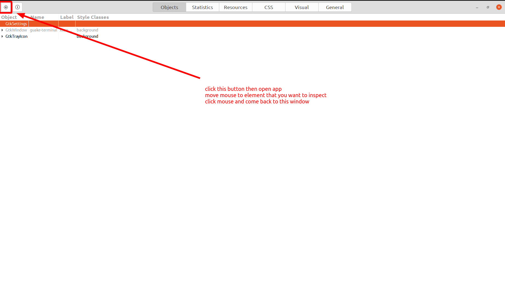
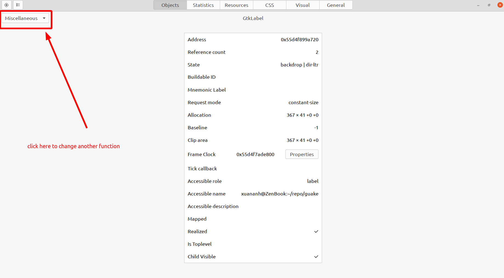
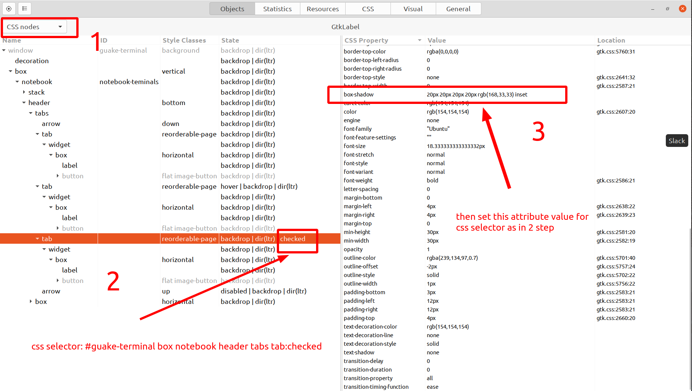
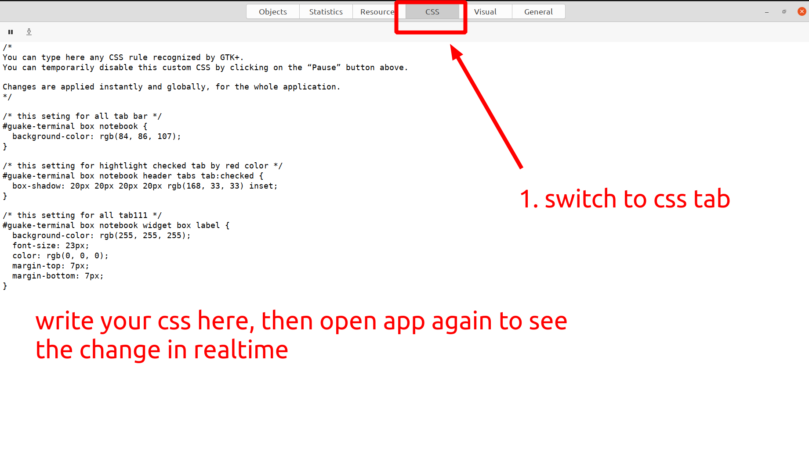

- [1. run on local](#1-run-on-local)
  - [1.1. prepare environment](#11-prepare-environment)
  - [1.2. debug](#12-debug)
- [2. How to use "mapping path then opening in vscode feature"](#2-how-to-use-mapping-path-then-opening-in-vscode-feature)
- [3. change stk css style](#3-change-stk-css-style)
  - [3.1. css file localtion](#31-css-file-localtion)
  - [3.2. using GTK Inspector for debug css](#32-using-gtk-inspector-for-debug-css)
  - [3.3. references](#33-references)
- [4. install](#4-install)
- [5. How to rename panes](#5-how-to-rename-panes)
  - [5.1. Via GUI](#51-via-gui)
  - [5.2. Via CLI](#52-via-cli)
  - [5.3. Example: Script with named panes](#53-example-script-with-named-panes)
  - [5.4. Pane label font size](#54-pane-label-font-size)
- [6. Read tab contents](#6-read-tab-contents)
  - [6.1. Via CLI](#61-via-cli)
  - [6.2. Via D-Bus](#62-via-d-bus)
- [7. Send text to a tab by name and press Enter](#7-send-text-to-a-tab-by-name-and-press-enter)
  - [7.1. Via CLI](#71-via-cli)
  - [7.2. Via D-Bus](#72-via-d-bus)
  - [7.3. Implementation notes](#73-implementation-notes)
- [8. Fix window resizing and positioning when switching monitors](#8-fix-window-resizing-and-positioning-when-switching-monitors)
- [9. Execute startup commands on session restore](#9-execute-startup-commands-on-session-restore)

# 1. run on local

## 1.1. prepare environment

```shell
pyenv local 3.9.0
venv_create

make local-setup-development-environment
# ./scripts/bootstrap-dev-debian.sh
make local-run
# make local-run-logging-DEBUG
```

## 1.2. debug

1. run guake with debugpy

```shell
make local-debug
```

2. run debug mode vscode
3. set breakpoints
4. reduce guake windows size, because when debug, guake terminal will stay in screen
5. do something in guake terminale

# 2. How to use "mapping path then opening in vscode feature"

1. Create configs file [.guake.json](.guake.json) in the root folder


2. cd to guake repo

```shell
cd /home/xuananh/repo/guake/
git checkout xuananh
```

3. copy bellow log and paste to terminal

```shell
Traceback (most recent call last):
  File "/app/main.py", line 190, in on_task_received
    strategy = strategies[type_]
```

4. Ctrl + click to "app/main.py", it will open [guake/main.py](guake/main.py) on vscode based on setting in file [.guake.json](.guake.json)

# 3. change stk css style

## 3.1. css file localtion

~/.config/gtk-3.0/gtk.css

## 3.2. using GTK Inspector for debug css

Run guake by command:

```shell
GTK_DEBUG=interactive make local-run
```

it will run guake and GTK Inspector :




do as above image to inspect element in guake, it will show as below



choose another function: CSS nodes as bellow



you can see above image to know how to get right css selector and set attribute for it

in above image, we got css selector for selected tab in guake terminal, then set its box-shadow color to highlight selected tab

you can test your css by switch to css tab



## 3.3. references

https://blog.gtk.org/2017/04/05/the-gtk-inspector/

https://gtkthemingguide.vercel.app/#/creating_gtk_themes?id=selectors

# 4. install

https://guake.readthedocs.io/en/latest/contributing/dev_env.html#install-on-system

```shell
make && sudo make install
```

or reinstall

```shell
make reinstall
```

# 5. How to rename panes

Panes (split terminals) can be renamed via GUI or CLI.

## 5.1. Via GUI

- Right-click on a pane → "Rename pane"
- Or use keyboard shortcut (configure in Preferences → Keyboard shortcuts)

## 5.2. Via CLI

```shell
# Rename pane at index 0 to "web"
guake -S 0 --rename-pane "web"

# Combine with execute command
guake -S 0 -E "cd ~/work && dlog container" --rename-pane "web"

# Reset pane name to default (empty)
guake -S 0 --rename-pane "-"
```

## 5.3. Example: Script with named panes

```shell
guake -S 0 -E "cd ~/work/viralize-web && dlog vvm2-web-1" --rename-pane "web"
guake -S 1 -E "cd ~/work/viralize && dlog vvm2-adserver-1" --rename-pane "viralize"
guake -S 2 -E "cd ~/work/viralize-web/components && dlog vvm2-web-components-1" --rename-pane "component"
```

## 5.4. Pane label font size

Configure in Preferences → Appearance → "Pane label font size" (range: 8-24)

Restart guake

# 6. Read tab contents

Read the text content (screen + scrollback) of a tab without switching to it.
Useful for scripting: grabbing the output of a long-running command in another
tab. `--lines N` limits the output to the last N lines; omit it (or use `0`) to
get the whole buffer.

> A "line" is a wrapped terminal row, matching what the terminal displays.
> Tabs holding several panes are returned with `--- Pane N ---` headers.

## 6.1. Via CLI

```shell
# Read the last 10 lines of the tab named "ez"
guake --tab-contents ez --lines 10

# Read the entire buffer of the tab named "ez"
guake --tab-contents ez

# Read the last 20 lines of the current terminal
guake --current-terminal-contents --lines 20
```

## 6.2. Via D-Bus

```shell
# By tab name (last 10 lines)
dbus-send --session --print-reply --type=method_call \
  --dest=org.guake3.RemoteControl /org/guake3/RemoteControl \
  org.guake3.RemoteControl.get_contents_from_tab_name string:'ez' int32:10

# Current terminal (whole buffer)
dbus-send --session --print-reply --type=method_call \
  --dest=org.guake3.RemoteControl /org/guake3/RemoteControl \
  org.guake3.RemoteControl.get_contents_current int32:0

# By tab index (last 10 lines)
dbus-send --session --print-reply --type=method_call \
  --dest=org.guake3.RemoteControl /org/guake3/RemoteControl \
  org.guake3.RemoteControl.get_contents_from_tab int32:0 int32:10
```

# 7. Send text to a tab by name and press Enter

refer to commit: `Send text to a tab by name and press Enter` for more detail

Guake can now send text directly to a tab by label, without scripts having to
scan tab indices with `guake -s INDEX` and compare labels with `guake -l`.

The new commands find the first tab whose label exactly matches the given name,
select that tab, focus the tab's last-focused pane, and fall back to the first
pane if no last-focused pane is known. There are separate actions for sending
text and pressing Enter, plus a convenience action that does both.

Enter is sent as carriage return (`\r`). This matters for TUI apps such as
Claude Code, REPLs, and prompts that treat line feed (`\n`) as "insert a new
line" instead of "submit".

If no matching tab exists, the CLI prints an error and exits non-zero.

## 7.1. Via CLI

```shell
# Type text only in the tab named "ez"
guake --send-text-tab-name ez "continue"

# Press Enter only in the tab named "ez"
guake --send-enter-tab-name ez

# Convenience wrapper: type "continue" and press Enter
guake --execute-tab-name ez "continue"
```

For scripts, this replaces the old pattern of selecting every tab by index,
checking the label, running `guake -E "continue"`, then sending `guake -E $'\r'`:

```shell
TAB_NAME="ez"

# Split actions
guake --send-text-tab-name "$TAB_NAME" "continue"
guake --send-enter-tab-name "$TAB_NAME"

# Or the combined action
guake --execute-tab-name "$TAB_NAME" "continue"
```

## 7.2. Via D-Bus

```shell
# Send text only
dbus-send --session --print-reply --type=method_call \
  --dest=org.guake3.RemoteControl /org/guake3/RemoteControl \
  org.guake3.RemoteControl.send_text_to_tab_name string:'ez' string:'continue'

# Press Enter only
dbus-send --session --print-reply --type=method_call \
  --dest=org.guake3.RemoteControl /org/guake3/RemoteControl \
  org.guake3.RemoteControl.send_enter_to_tab_name string:'ez'

# Type text and press Enter
dbus-send --session --print-reply --type=method_call \
  --dest=org.guake3.RemoteControl /org/guake3/RemoteControl \
  org.guake3.RemoteControl.execute_command_in_tab_name string:'ez' string:'continue'
```

## 7.3. Implementation notes

- `guake/main.py` adds `--send-text-tab-name NAME TEXT`,
  `--send-enter-tab-name NAME`, and `--execute-tab-name NAME COMMAND`.
- `guake/dbusiface.py` exposes `send_text_to_tab_name(tab_name, text)`,
  `send_enter_to_tab_name(tab_name)`, and
  `execute_command_in_tab_name(tab_name, command)`.
- `guake/guake_app.py` implements the tab lookup, pane selection, focus, and
  carriage-return Enter behavior.

# 8. Fix window resizing and positioning when switching monitors

This commit makes Guake recompute its final window rectangle from the target
monitor workarea every time it is shown or resized by preferences. The final
rectangle uses the configured width, height, alignment, and displacement values.

For non-fullscreen windows, Guake unmaximizes, resizes to the configured
rectangle, lets GTK process the resize, then moves the window. This avoids
position drift and off-screen placement when moving between monitors with
different resolutions.

The commit also keeps the configured rectangle stable during normal usage:
after a hidden window is shown, Guake reapplies the configured rectangle once
the window manager has finished restoring state, and terminal-specific config
reloads skip global window geometry so opening a new tab does not unexpectedly
resize the Guake window.

# 9. Execute startup commands on session restore

refer to commit: `Add support for executing startup commands in ~/.config/guake/session.json` for more detail

Guake remembers the command it launched in a pane and re-runs it when the
session is restored, so panes that run long-lived processes (dashboards, log
tails, dev servers, `htop`, `watch ...`) come back running the same command
instead of an empty shell.

A pane's startup command is recorded whenever Guake itself launches a command in
it — via `guake -e "..."`, the D-Bus `execute_command` method, or a
split-with-command. Commands you type by hand into the shell are not captured,
because Guake has no way to know which one "defines" the pane. The most recent
command Guake ran in a pane is the one that is saved and replayed.

Restoring only works when tab-session saving is enabled
(Preferences → General → "Automatically save tabs session when changed", the
`save-tabs-when-changed` setting), so `session.json` is kept up to date.

## 9.1. Example

```shell
# Run htop in the current pane; it is restored on the next launch
guake -e "htop"

# Or via D-Bus
dbus-send --session --print-reply --type=method_call \
  --dest=org.guake3.RemoteControl /org/guake3/RemoteControl \
  org.guake3.RemoteControl.execute_command string:'htop'
```

## 9.2. How it is stored

Each terminal pane in `~/.config/guake/session.json` gains a `command` field:

```json
{
  "type": "term",
  "directory": "/home/user",
  "command": "htop"
}
```

`"command": null` means the pane had no Guake-launched command and restores as a
plain shell.

## 9.3. Implementation notes

- `guake/terminal.py`: `GuakeTerminal.startup_command` stores the command;
  defaults to `None`.
- `guake/guake_app.py`: `execute_command` and `execute_command_by_uuid` record
  the command onto the target terminal when Guake runs it.
- `guake/boxes.py`: `save_box_layout` writes the `command` field to
  `session.json`; `restore_box_layout` re-runs it (after a short delay so the
  shell is ready) once the pane has been recreated.
