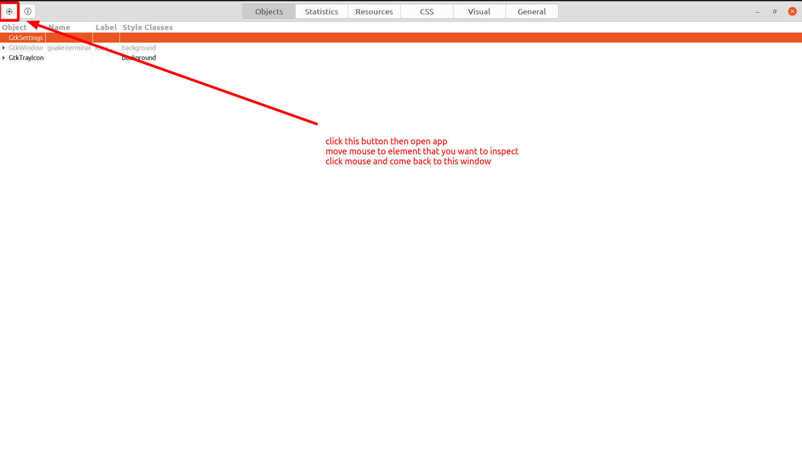
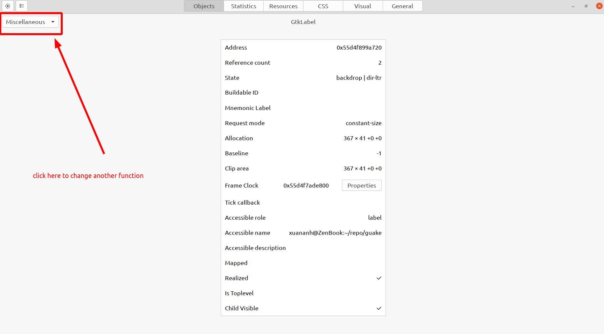
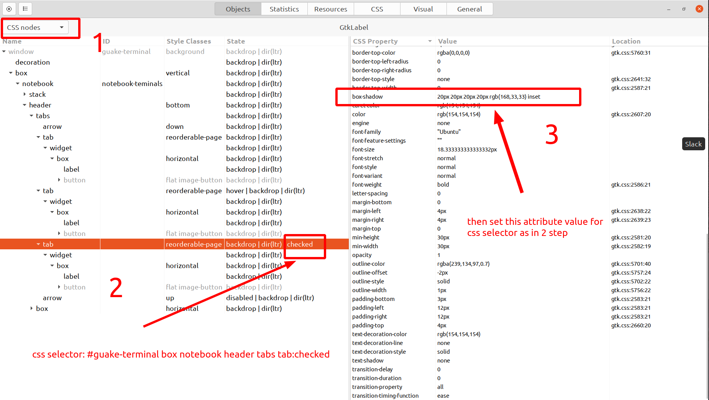

- [1. run on local](#1-run-on-local)
  - [1.1. prepare environment](#11-prepare-environment)
  - [1.2. debug](#12-debug)
- [2. How to use "mapping path then opening in vscode feature"](#2-how-to-use-mapping-path-then-opening-in-vscode-feature)
- [3. Patch current guake](#3-patch-current-guake)
  - [3.1. create patch](#31-create-patch)
  - [3.2. apply patch](#32-apply-patch)
- [4. change stk css style](#4-change-stk-css-style)
  - [4.1. css file localtion](#41-css-file-localtion)
  - [4.2. using GTK Inspector for debug css](#42-using-gtk-inspector-for-debug-css)
  - [4.3. references](#43-references)
- [5. cherry-pick and rebase into one commit](#5-cherry-pick-and-rebase-into-one-commit)
- [6. install](#6-install)

# 1. run on local

## 1.1. prepare environment

```shell
pyenv local 3.9.0
venv-create

make local-setup-development-environment
# ./scripts/bootstrap-dev-debian.sh
make local-run
# make local-run-logging-DEBUG
```

## 1.2. debug

1. run guake with debugpy

```shell
make local-debug
```

2. run debug mode vscode
3. set breakpoints
4. reduce guake windows size, because when debug, guake terminal will stay in screen
5. do something in guake terminale

# 2. How to use "mapping path then opening in vscode feature"

1. Create configs file [.guake.json](.guake.json) in the root folder


2. cd to guake repo

```shell
cd /home/xuananh/repo/guake/
git checkout xuananh
```

3. copy bellow log and paste to terminal

```shell
Traceback (most recent call last):
  File "/app/main.py", line 190, in on_task_received
    strategy = strategies[type_]
```

4. Ctrl + click to "app/main.py", it will open [guake/main.py](guake/main.py) on vscode based on setting in file [.guake.json](.guake.json)

# 3. Patch current guake

## 3.1. create patch

```shell
git --no-pager diff --no-index --patch \
  --output=/home/xuananh/Dropbox/Work/Other/conf.d/guake/guake_patch.diff \
  terminal_origin.py \
  terminal_customized.py
```

## 3.2. apply patch

```shell
sudo patch -p1 /usr/lib/python3/dist-packages/guake/terminal.py \
  /home/xuananh/Dropbox/Work/Other/conf.d/guake/guake_patch.diff

# ------- output
# patching file /usr/lib/python3/dist-packages/guake/terminal.py
# Hunk #1 succeeded at 272 (offset 14 lines).
# Hunk #2 succeeded at 340 (offset 14 lines).
# Hunk #3 succeeded at 424 (offset 14 lines).

```

You can see that the above file is patched successfully with offset, it means that this file change quite lot from the time creating patch file. 

In case patching fail because there is a lot of change, you should create new patch file by these steps:

1. create 2 new file to create patch

```shell
cp /usr/lib/python3/dist-packages/guake/terminal.py ~/Downloads/terminal_origin.py
cp /usr/lib/python3/dist-packages/guake/terminal.py ~/Downloads/terminal_customized.py
```

2. change file `~/Downloads/terminal_origin.py` based on branch `xuananh`, then create patch file again using command in [3.1. create patch](#31-create-patch)

# 4. change stk css style

## 4.1. css file localtion

~/.config/gtk-3.0/gtk.css

## 4.2. using GTK Inspector for debug css

Run guake by command:

```shell
GTK_DEBUG=interactive make local-run
```

it will run guake and GTK Inspector :




do as above image to inspect element in guake, it will show as below



choose another function: CSS nodes as bellow



you can see above image to know how to get right css selector and set attribute for it

in above image, we got css selector for selected tab in guake terminal, then set its box-shadow color to highlight selected tab

you can test your css by switch to css tab


## 4.3. references

https://blog.gtk.org/2017/04/05/the-gtk-inspector/

https://gtkthemingguide.vercel.app/#/creating_gtk_themes?id=selectors

# 5. cherry-pick and rebase into one commit

```shell
# create new branch to cherry-pick
git checkout -b xuananh-add-new-feature-mapping-file-path-to-open-in-vscode xuananh-backup

# reset new branch to the commit from that XuanAnh start add new commit
git checkout master
git branch -f xuananh-add-new-feature-mapping-file-path-to-open-in-vscode c3f3a60d943ece1918aad3f077118145d9f61aeb
git checkout xuananh-add-new-feature-mapping-file-path-to-open-in-vscode

# cherry pick 11 commits from branch xuananh-backup
git cherry-pick d685fe66132fc5f4c811dbae90a27bd7154e7840
git cherry-pick 78f69d20cb8d5cc0bd27a15d090cbc2c98ce6a5a
git cherry-pick 417fcbc82ab6420928dfaf666511855b73438040
git cherry-pick f1efff96d51f921d42874e04399d7b65358aa47b
git cherry-pick 2162ce10374b493374c36fc1f899e02d3a55c008
git cherry-pick f0d06d0c5023991f5977e5f2b437ab4ceea653e4
git cherry-pick 93cbcbe445f012e5264b303ac364665b173e7231
git cherry-pick 1cb171f96f08d04577261df43abd17bedb57fdd9
git cherry-pick 9a13c20707b9841812fb223628676e38146340a3
git cherry-pick 0348b2988d03e8290cbf0dbd91457b61078f44b0
git cherry-pick 286977fcf754168ca7e13dd0ec8fa92cec60f824

# create new branch to rebase
git checkout -b xuananh-add-new-feature-mapping-file-path-to-open-in-vscode-rebased xuananh-add-new-feature-mapping-file-path-to-open-in-vscode

# rebase above 11 commits, reference on how to rebase
# https://www.freecodecamp.org/news/git-squash-commits/
# https://stackoverflow.com/a/21278908
git rebase --interactive HEAD~11

# create new branch with shorter name
git checkout -b xuananh xuananh-add-new-feature-mapping-file-path-to-open-in-vscode-rebased

```

# 6. install

https://guake.readthedocs.io/en/latest/contributing/dev_env.html#install-on-system

`make && sudo make install`

or reinstall

`make reinstall`